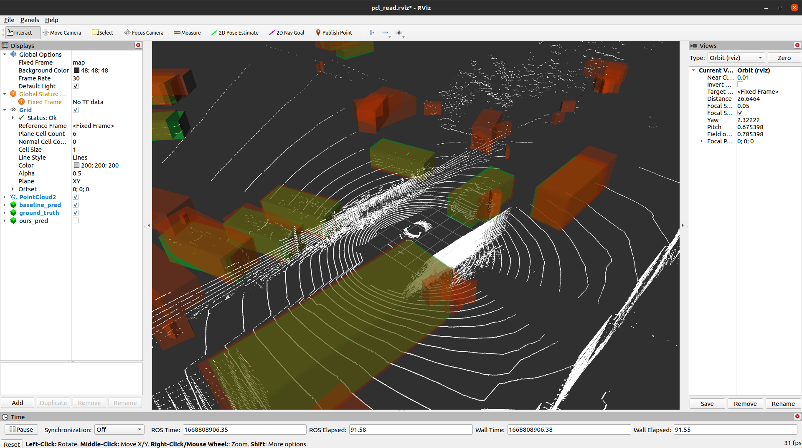
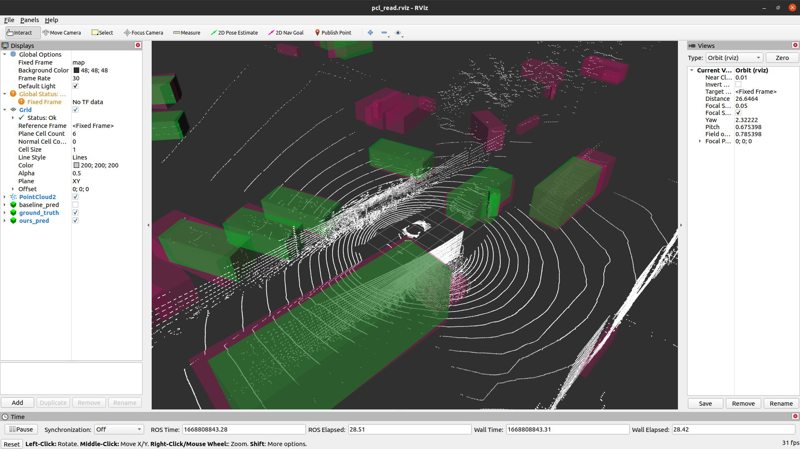

# ROS read .obj
visualize point cloud of .npy type and 3d bboxes of .obj file in Rviz via ROS noetic  

  

| baseline pred VS. ground truth               | ours pred VS. ground truth               |
| :------------------------------------------- | :--------------------------------------- |
|  |  |
| green:  ground truth BBox                                                               |
| orange: baseline pred BBox                                                              |
| pink:   ours pred BBox                                                                  |


## Build
build the workspace
```bash
source /opt/ros/noetic/setup.bash
cd ros_objread/catkin_ws
catkin build
```
make the `.py` node script executable
```bash
cd src/pcl_publisher/scripts
chmod +x pcl_publisher.py
```
## Run
```bash
cd ros_objread/catkin_ws
source devel/setup.bash
```
```bash
# stay in ros_objread/catkin_ws
# with sourced devel/setup.bash:
# Sub-Terminal A
roscore
# Sub-Terminal B
rosrun pcl_publisher pcl_publisher.py
# Sub-Terminal C
rviz -d ../pcl_read.rviz
```
## Folder organizations
```bash
ros_objread
├── catkin_ws
│   ├── build   # generated after catkin build
│   ├── log     # generated after catkin build
│   ├── devel   # generated after catkin build
│   └── src
│       ├── CMakeLists.txt
│       └── pcl_publisher   # ros package
│           ├── CMakeLists.txt
│           ├── package.xml
│           ├── include
│           ├── scripts     # containing .py node scripts
│           ├── src
│           └── obj
│               ├── baseline_pred   # containing .obj files of baseline_pred bbox
│               ├── gt              # containing .obj files of gt bbox
│               └── ours_pred       # containing .obj files of ours_pred bbox
├── cp_vis
│   └── pc          # containing .npy files of point cloud
└── pcl_read.rviz   # rviz config file
```
